## 메인페이지 ##
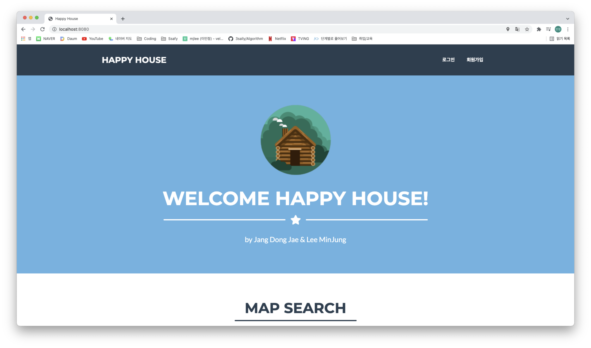
## 메인페이지 - 지도 ##
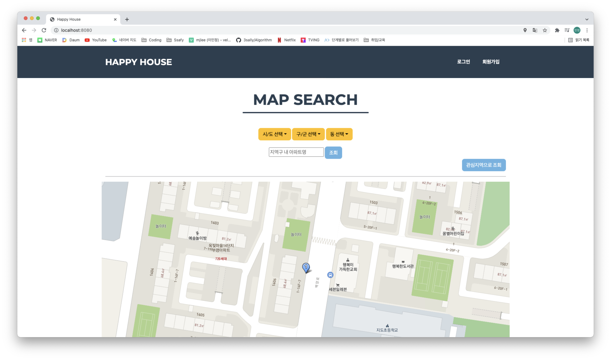
## 드롭박스로 지역 선택 후 마지막 동을 선택하면 바로 지도에 결과 띄워짐 ##
## 그리고 옆에 리스트로 지역 내의 아파트 정보 보여짐 ##
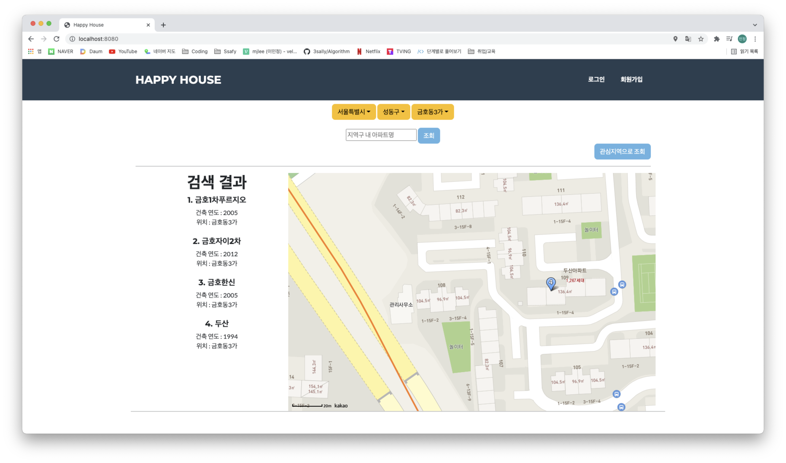
## 옆에 리스트의 아파트를 선택하면 모달창으로 해당 아파트 거래내역이 보여짐 ##
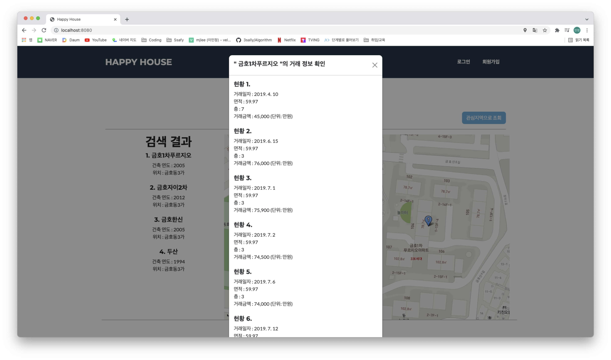
## 해당 지역내의 특정 아파트만을 검색할 수 있음 ##
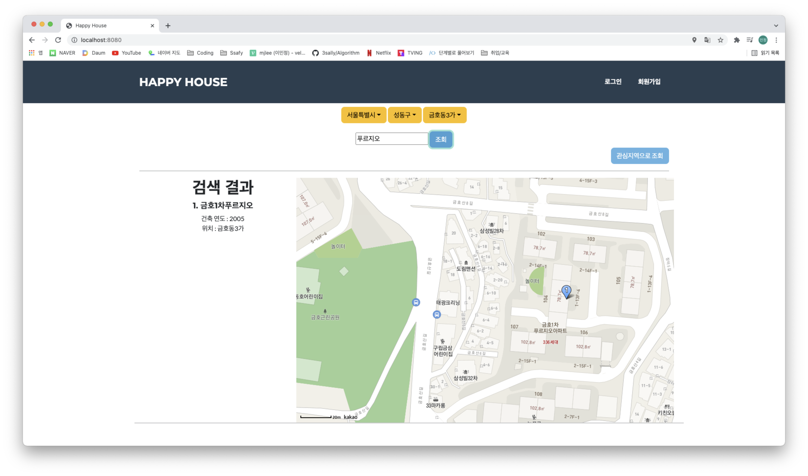
## 회원가입 ##
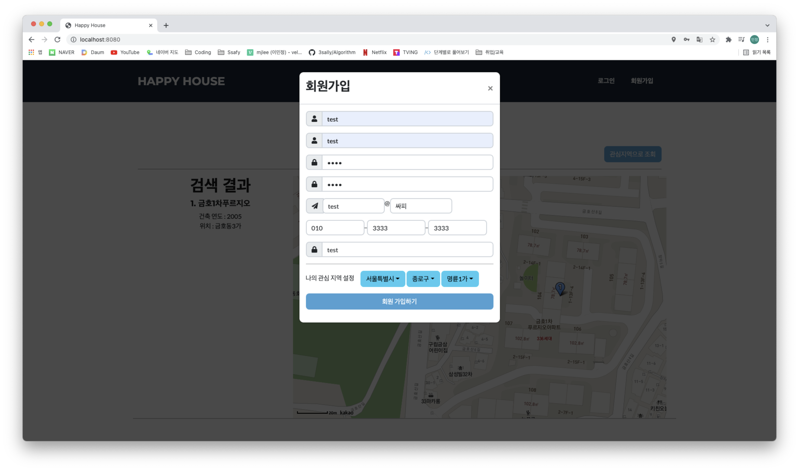
## 로그인 성공 시 메인페이지 ##
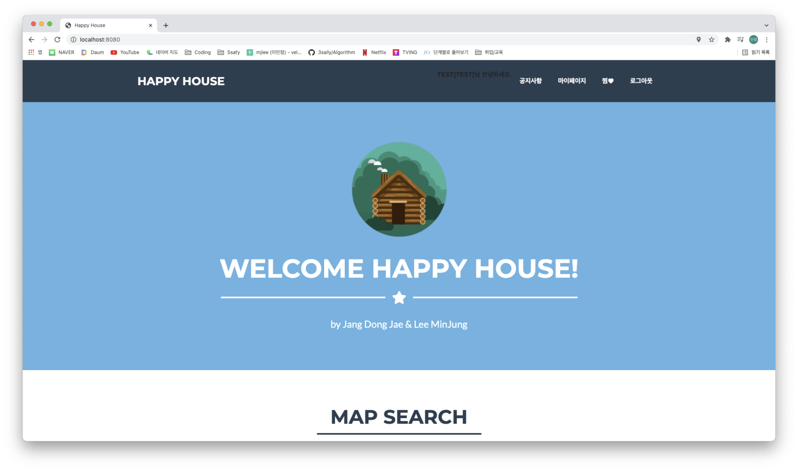
## 회원가입 시 선택한 관심지역을 보여줌 -> 로그인 안했을 때 누르면 안됨  ##
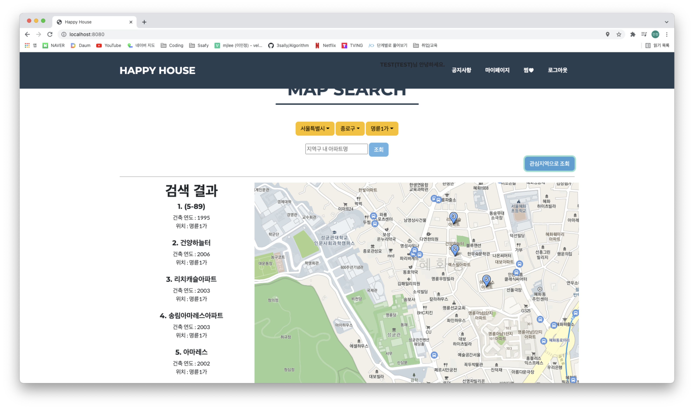
## 일반회원은 공지사항 글 열람만 가능 ##
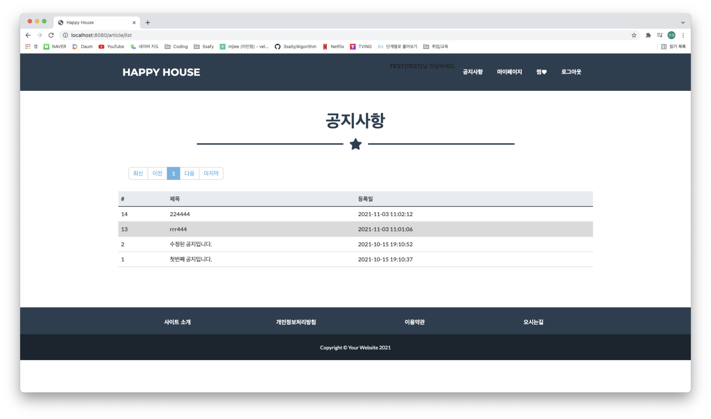
## 관리자는 공지사항 글 수정,등록,삭제 가능 ##
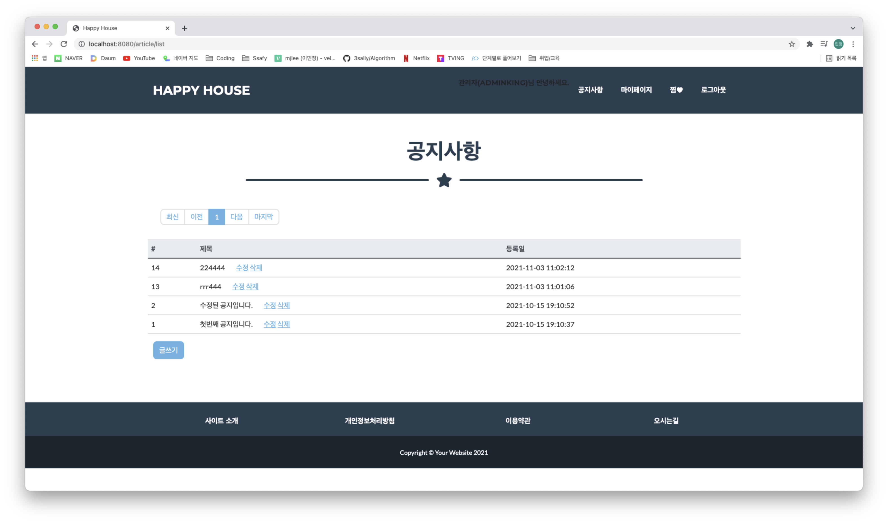
## 공지 삭제 ##
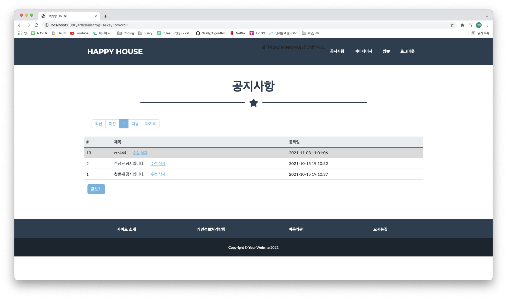
## 공지 수정 ##
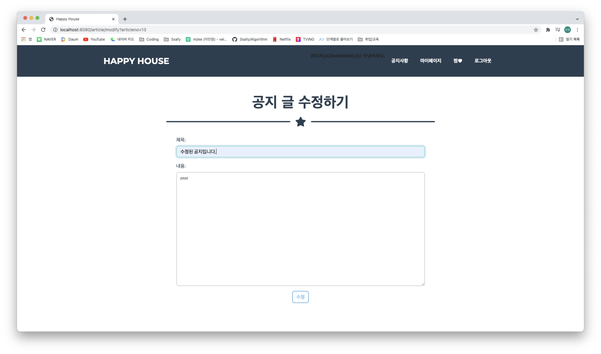
## 공지 수정됨을 확인 ##
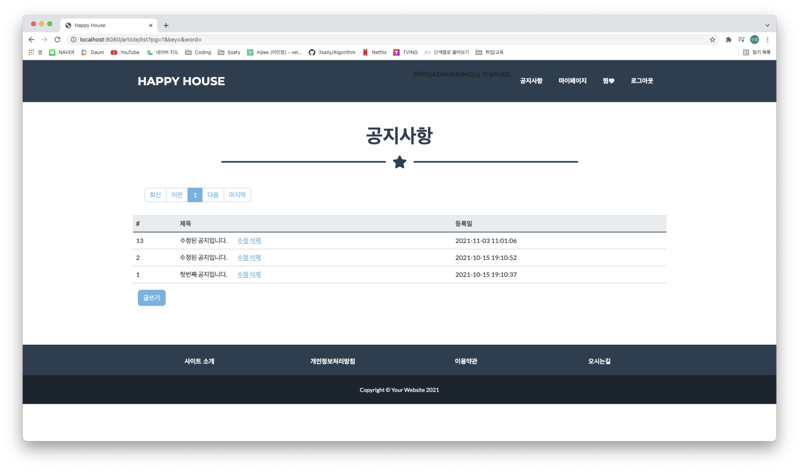
## 마이페이지 - 사용자 등록 정보 확인 ##

## 비밀번호 변경 ##
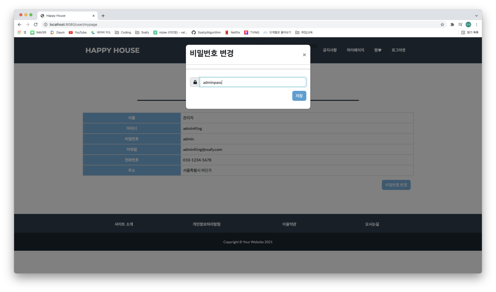
## 비밀번호 변경 확인 ##
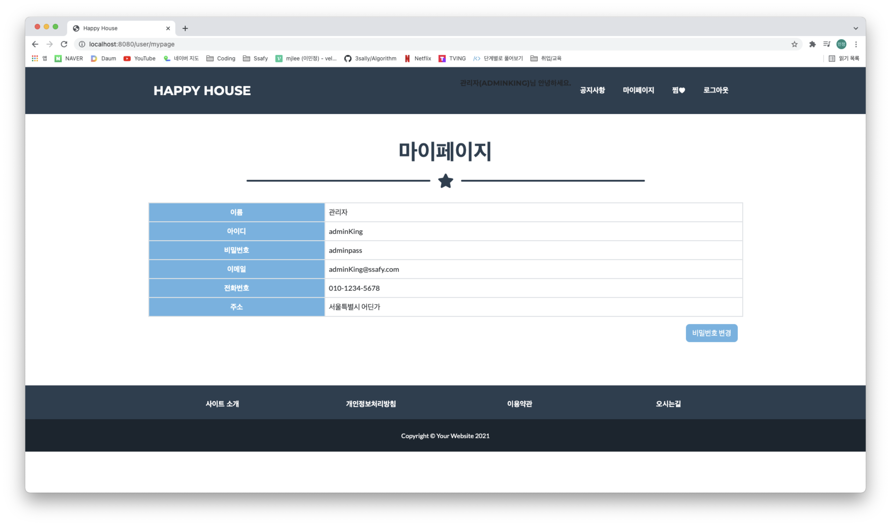
---
---
<알고리즘>
1. 아파트 매매량이 많은 지역을 원형으로 더 잘 보이게 (인기거래지역)
    - 알고리즘을 적용할 만한 부분 → 선택 구역(구)내의 매매량이 많은 지역 반경을 표시
    - 어떤 알고리즘을 적용하여 구현할 수 있는지 → 우선순위 큐를 활용하여 매매량이 많은 순으로 구현
    - 어떤 점이 좋아지는지 → 사용자에게 인기 있는 지역을 한 눈에 볼 수 있게 해줌
    - 적용시 문제점  → 딱히 없다.
2. 회원가입 시 사용자의 관심사를 체크 (예, 카페, 음식점, 옷가게)
    - 알고리즘을 적용할 만한 부분 → 회원의 관심사에 적합한 지역을 추천해줌
    - 어떤 알고리즘을 적용하여 구현할 수 있는지 → 사용자의 정보를 기반으로 관련 콘텐츠를 제안하는 추천 알고리즘
    - 어떤 점이 좋아지는지 → 사용자의 적합한 거주지역을 쉽게 알 수있다
    - 적용시 문제점  → 지역을 한정적으로만 보게 될수 있음 / 생각하고 있던 지역과 동떨어진 곳을 추천받을 수 있음
